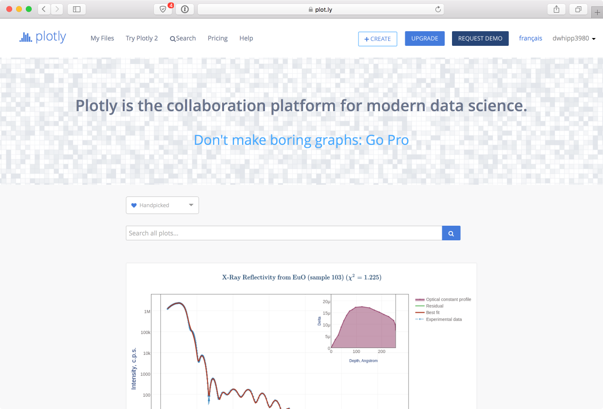
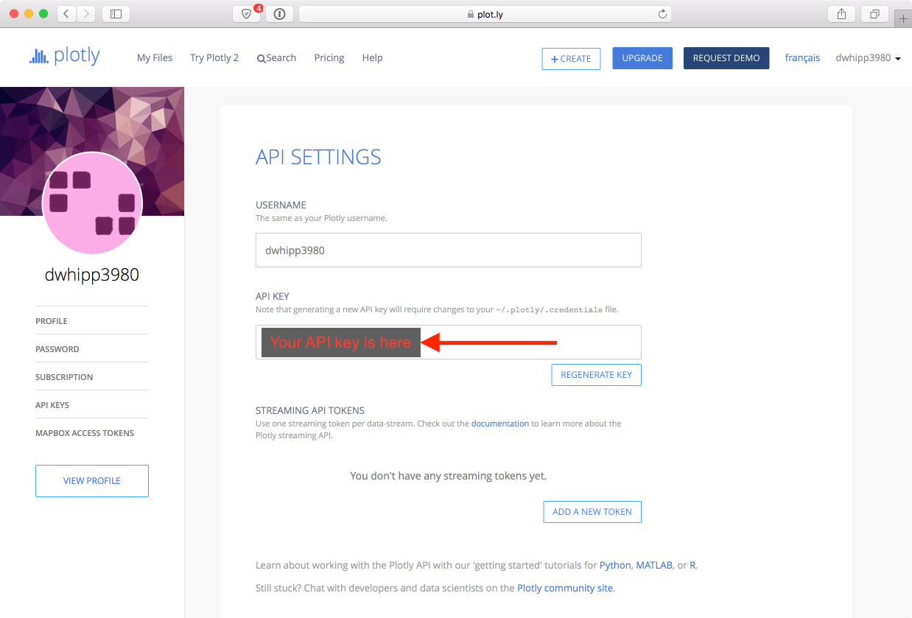

# Connecting Matplotlib with plotly
In the final part of this week's lesson, we will learn how to automatically export plots from [matplotlib](http://matplotlib.org/) to [plotly](https://plot.ly/), where they can be manipulated and shared online.

## Topics
1. 
2. 
3. 

## Plotly overview
<br/>
*The plot.ly website*

[Plotly](https://plot.ly/) is a web-based collaborative data visualization site where you can easily produce interactive plots and perform basic statistical analyses of data.
On the site you can find hundreds of example plots that you can view, interact with, and edit.
Essentially, it is a social plotting and data analysis site, and fortunately the basic community accounts are free.
We'll explore a few basic things we can do with plotly, mainly exporting matplotlib plots to plotly using [Plotly for Matplotlib](https://plot.ly/matplotlib/).
If you're interested in learning more, you may want to start by looking at the [plotly tutorials](http://help.plot.ly/tutorials/).

We're of the opinion that web-based interactive data is the future, and fortunately it is extremely easy to take your basic plots from matplotlib and directly export them to plotly.

## Configuring matplotlib to work with plotly
The Plotly for Matplotlib modules are already installed on the computer instances for the course, but in order to be able to have plots in matplotlib automatically be tranferred to plotly, you need to have a special "API key" that connects your computer to your plotly account.

1. You can find your personal API key by going to the [plotly API settings page](). You will be asked to log in to access this page.
2. After you have logged in, you should see the API settings page, which includes a value for your API key as shown in the image below.

    <br/>
You should select your plotly API key and copy it to the clipboard.
3. After you have copied your plotly API key, you should go to the Terminal window on your computer instance.
If you have closed it, open another by double clicking on the **Terminal** icon on the Desktop.
4. In the terminal window, enter the following command, substituting your plotly user name for `<username>` and your API key for `<api key>`. **Note**: This should be done in a **Terminal** window, not an IPython console!

    ```bash
    $ python -c "import plotly; plotly.tools.set_credentials_file(username='<username>', api_key='<api key>')"
    ```
This command will set up the connection between your computer instance and plotly.
**Note**: On the cloud computers, you will need to do this every time you start a new computer instance.
If you are working on your personal computer, you should only need to do this once (though you may need to [install plotly](https://plot.ly/matplotlib/getting-started/#installation))

At this point you should be all set to start exporting plots to plotly.

## Saving your first matplotlib plot to plotly
